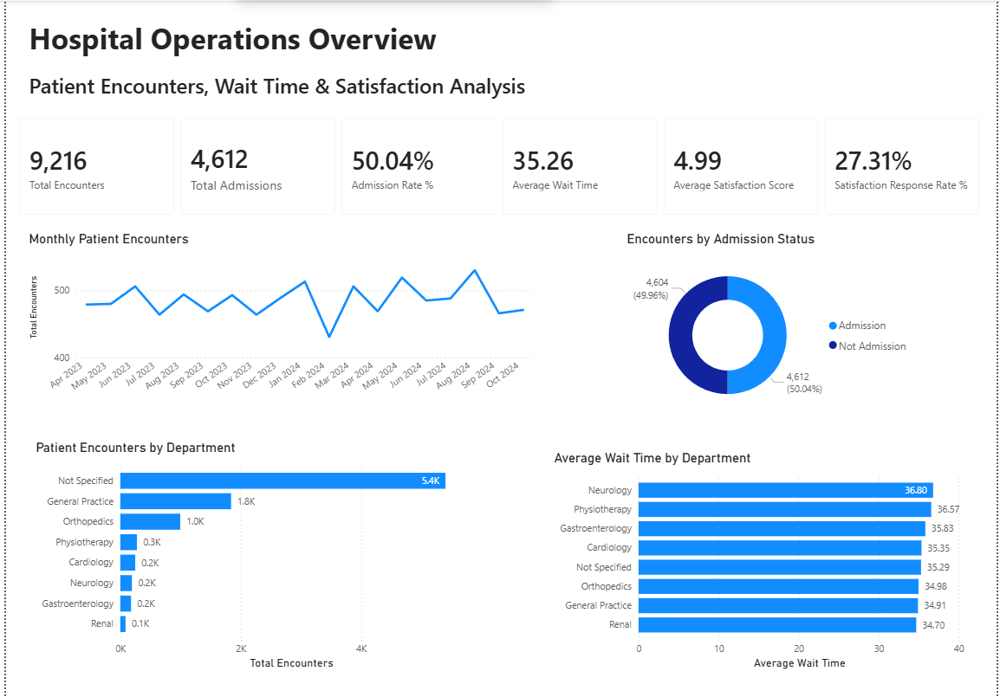
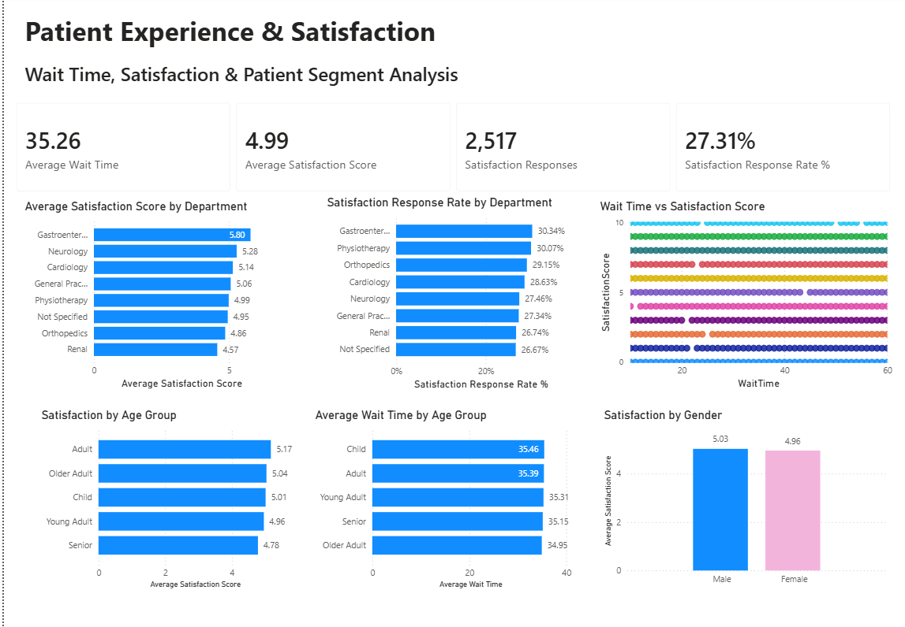
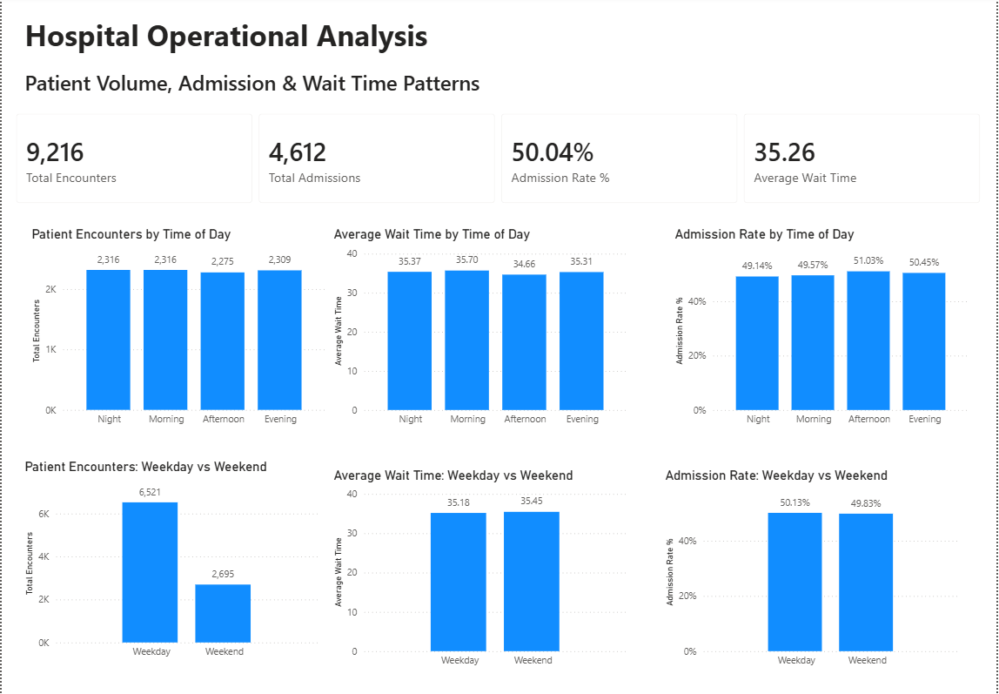

# Hospital Operations & Patient Analytics

## Project Overview

This project presents an end-to-end analysis of hospital patient encounters to understand **patient volume, admission patterns, wait times, department performance, and patient satisfaction**.

### Analytics Workflow

**Python ETL & Analysis → SQL Server Data Warehouse → Power BI Dashboard → Business Insights**

**Dataset:** 9,216 patient encounters

---

## Business Objective

The analysis was designed to answer key operational questions:

- How many patient encounters and admissions occurred?
- What is the overall admission rate?
- What is the average patient wait time?
- Which departments handle the highest patient volumes?
- How does wait time vary across departments?
- How do operational patterns differ by time of day and weekday/weekend?
- How does satisfaction vary across departments and patient groups?
- Is there a relationship between patient wait time and satisfaction?

---

## Tools & Technologies

| Tool | Usage |
|---|---|
| **Python (Pandas, NumPy)** | Data profiling, cleaning, transformation, ETL and statistical analysis |
| **SQL Server** | Staging, dimensional modelling, validation and analytical SQL |
| **Power BI** | Data modelling, DAX measures, KPI reporting and dashboards |
| **Jupyter Notebook** | Python ETL and exploratory analysis |

---

## End-to-End Analytics Workflow

### 1. Python ETL & Analysis

Python was used to:

- Profile the raw hospital dataset
- Clean and standardize data
- Convert and validate date fields
- Handle missing values
- Create derived analytical fields
- Validate categorical and numerical fields
- Perform exploratory data analysis
- Analyse the relationship between patient wait time and satisfaction

The cleaned dataset was then prepared for loading into SQL Server.

### 2. SQL Server Data Warehouse

A dimensional model was created with:

- `dim_patient`
- `dim_department`
- `dim_calendar`
- `fact_patient_encounter`

Primary and foreign key relationships were implemented to create a **star-schema structure**.

SQL analysis included:

- Row-count validation
- Duplicate and NULL checks
- Fact-to-dimension validation
- Department performance
- Admission analysis
- Time-of-day patterns
- Monthly encounter trends
- Weekday vs weekend analysis
- Age-group analysis
- Overall hospital KPIs

### 3. Power BI Dashboard

Three dashboard pages were developed:

1. **Executive Overview**
2. **Patient Experience & Satisfaction**
3. **Hospital Operational Analysis**

---

## Key KPIs

| KPI | Result |
|---|---:|
| Total Patient Encounters | **9,216** |
| Total Admissions | **4,612** |
| Admission Rate | **50.04%** |
| Average Wait Time | **35.26 minutes** |
| Average Satisfaction Score | **4.99** |
| Satisfaction Responses | **2,517** |
| Satisfaction Response Rate | **27.31%** |

---

## Key Findings

### Patient Volume & Admissions

- The dataset contains **9,216 patient encounters**.
- **4,612 encounters resulted in admission**, representing a **50.04% admission rate**.
- Monthly encounter volumes were relatively stable across the analysed period.

### Department Performance

- A large proportion of encounters had no specified department referral.
- General Practice and Orthopedics were among the higher-volume specified departments.
- Average waiting time varied only modestly across departments.

### Operational Patterns

- Patient volume was relatively evenly distributed across different times of day.
- Average wait times were similar across time-of-day groups.
- Weekdays recorded substantially more encounters than weekends.
- Despite the volume difference, weekday and weekend average wait times were very similar.

### Patient Satisfaction

- Average satisfaction among available responses was approximately **4.99**.
- Satisfaction showed some variation across departments and age groups.
- Satisfaction results should be interpreted carefully because response coverage was limited.

---

## Wait Time vs Patient Satisfaction

Python Pearson correlation analysis was used to investigate whether longer wait times were associated with lower patient satisfaction.

> **Pearson correlation: r ≈ -0.021**

The correlation is extremely close to zero, indicating **almost no linear relationship between patient wait time and satisfaction score in this dataset**.

The Power BI scatter plot visually supported this finding.

This does not mean wait time can never influence patient satisfaction. It means the available dataset did not show a meaningful linear relationship between the two variables.

---

## Data Limitation

Only **2,517 of 9,216 encounters (27.31%)** contained satisfaction responses.

Therefore, satisfaction-related findings represent only the subset of encounters with recorded responses and should **not automatically be generalized to the entire patient population**.

---

# Power BI Dashboard

## Executive Overview



## Patient Experience & Satisfaction



## Operational Analysis



---

## Business Recommendations

- Improve department-referral data capture where appropriate.
- Continue monitoring department-level wait times.
- Investigate drivers behind monthly patient-volume fluctuations.
- Increase satisfaction-survey participation to obtain more representative feedback.
- Avoid assuming that wait time alone explains satisfaction.
- Investigate additional factors such as service quality, communication, treatment experience and patient expectations.
- Continue monitoring operational KPIs by time of day and weekday/weekend to support staffing and resource planning.

---

## Repository Structure

```text
Hospital-Operations-Patient-Analytics/
│
├── dashboard/
│   └── Hospital_Operations_Analytics.pbix
│
├── images/
│   ├── 01_Executive_Overview.png
│   ├── 02_Patient_Experience.png
│   └── 03_Operational_Analysis.png
│
├── notebooks/
│   └── 01_Hospital_ETL.ipynb
│
├── sql/
│   └── Hospital_Analytics_DW.sql
│
└── README.md
```

---

## Skills Demonstrated

**Python ETL • Pandas • Data Cleaning • Exploratory Data Analysis • Statistical Analysis • SQL Server • Data Warehousing • Star Schema • Analytical SQL • Power BI • DAX • KPI Reporting • Data Visualization • Business Analysis**
